推荐常用的工具
#目录
1. Alfred 
2. MindNode 
3. Moom 
4. Mou 
5. OmniGraffle
6. ShawodsocksX
7. VirtualBox
8. Wallpapers 
9. f.lux 
10. pocket 

##[Alfred](http://www.alfredworkflow.com)
Alfred高效的工作流软件
####dash快速查询API
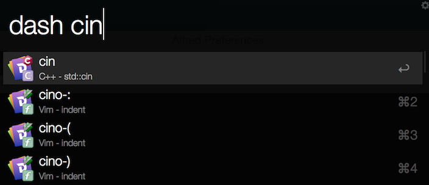
####kill进程
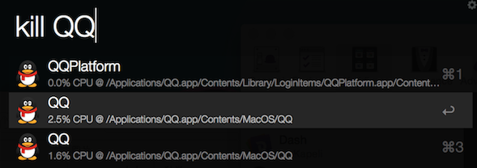

####从终端itrem跳转到文件路径

####从文件路径跳转到终端itrem
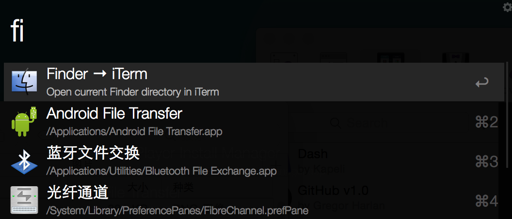

####各地时间查询

##[Beyond compare](http://www.scootersoftware.com)
文件比较工具,除了常规的文本比较外,还提供了三方比较、文件夹比较的功能。

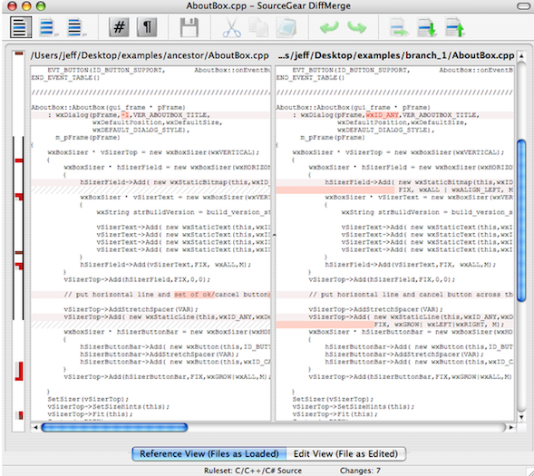

##[brewhome](https://github.com/Homebrew/homebrew/wiki/installation)
包管理工具

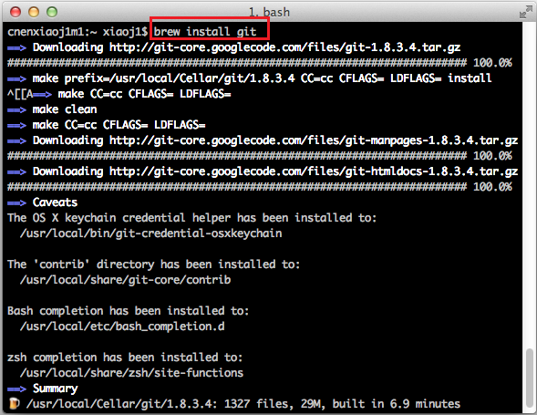

##[CheatSheet](http://www.mediaatelier.com/CheatSheet/)
快捷键快速提醒工具,需要按住Command键,会弹出当前应用的所有快捷键列表,

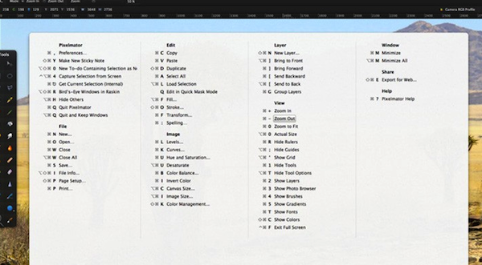

##[Dash](https://kapeli.com/dash)
API文档浏览搜索和代码片段管理功能

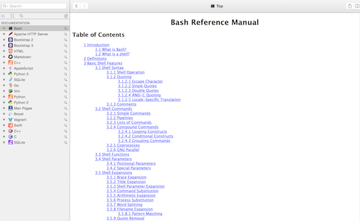

##[DropBox](http://www.dropbox.com)
文件同步

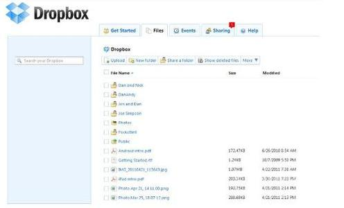

##[Iterm2](http://iterm2.com)
终端增强

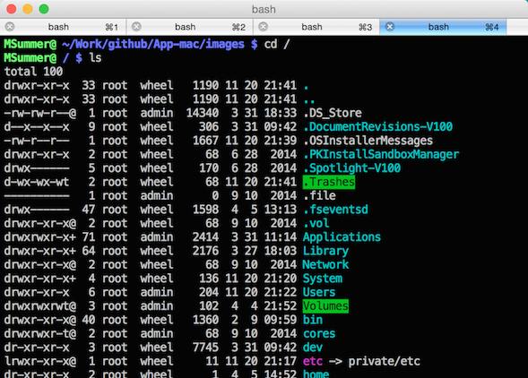

##[MindNode](https://mindnode.com)
思维导图

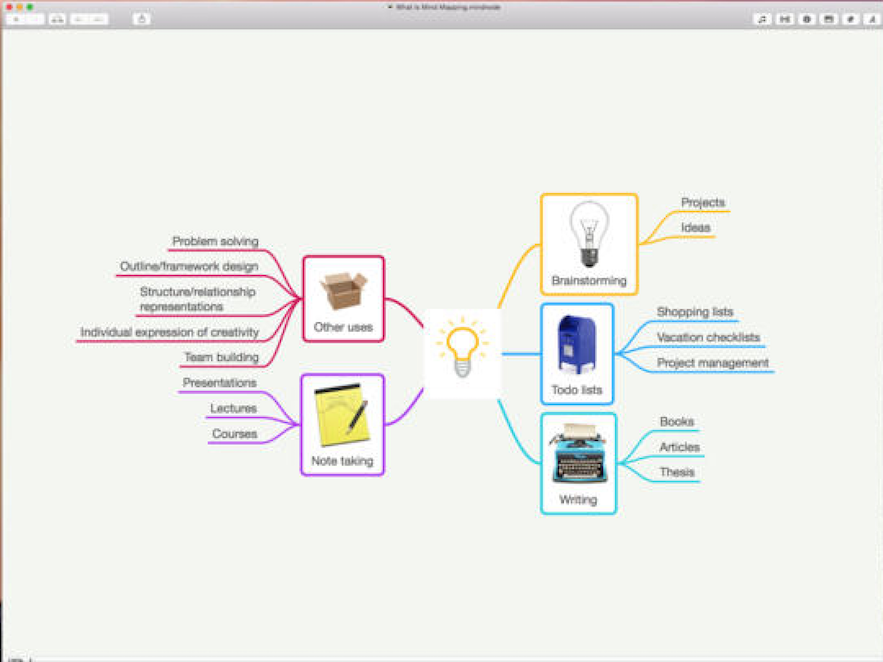

##[Moom](http://manytricks.com/moom/)
窗口管理及布局,多屏切换

##[Mou](http://25.io/mou/)
markdown编辑器

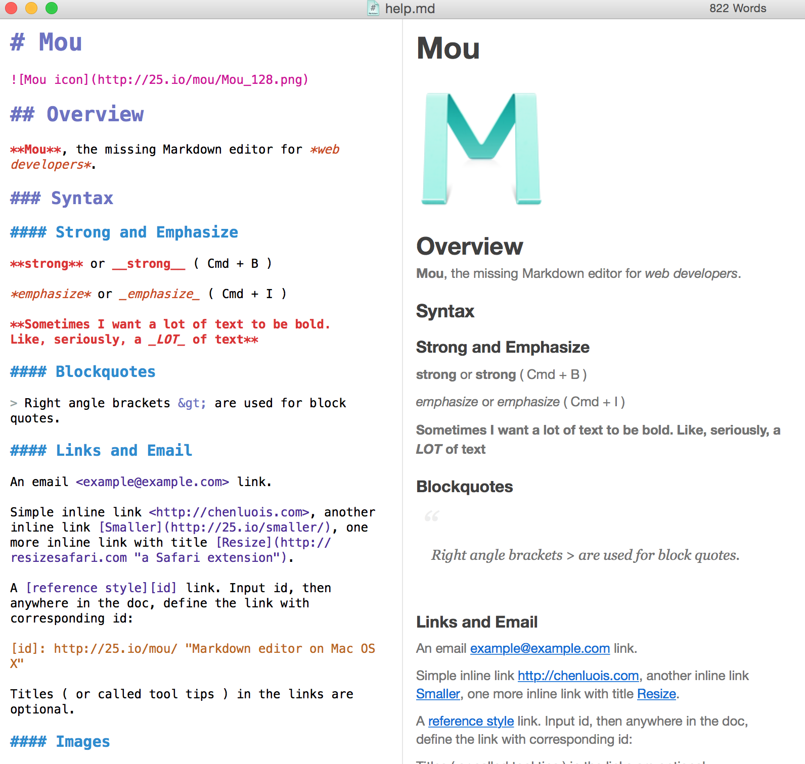

##[OmniGraffle](https://www.omnigroup.com/omnigraffle/)
绘图

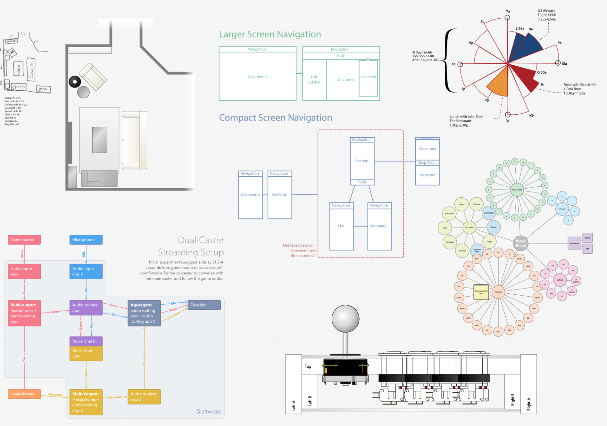

##[ShadowsocksX](https://github.com/shadowsocks/shadowsocks-iOS/wiki/Shadowsocks-for-OSX-帮助)
翻墙

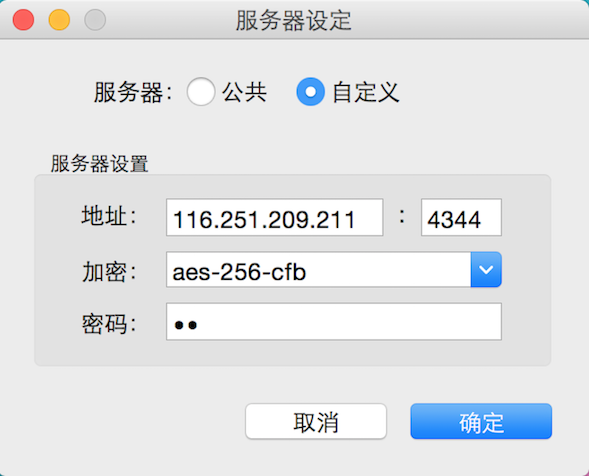

##[VirtualBox](https://www.virtualbox.org)
虚拟机

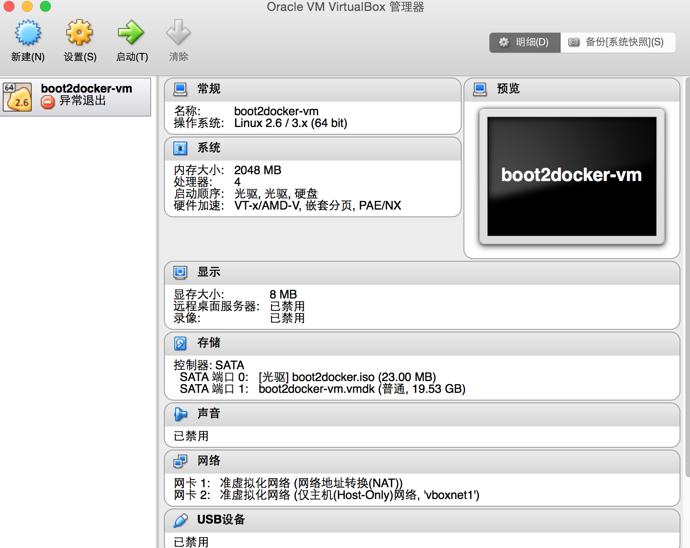

##[Wallpapers](https://itunes.apple.com/app/retina-wallpapers-hd-640x960/id384922950?mt=8)
高清桌面壁纸

##[Pocket](https://www.getpocket.com/)
网页保存,可以在不同平台上阅读

##[f.lux](https://justgetflux.com)
自动调节色温，对眼睛好

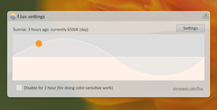

