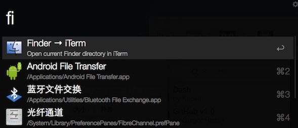
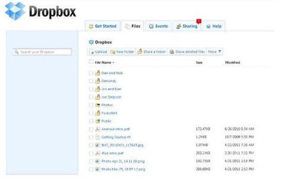
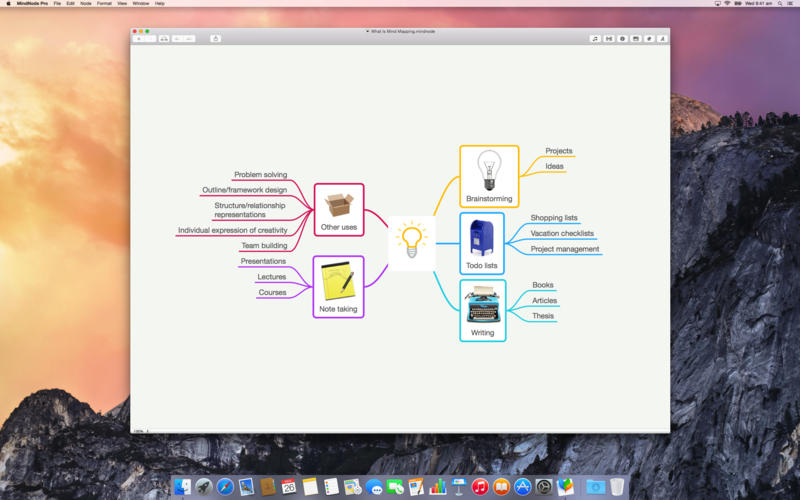
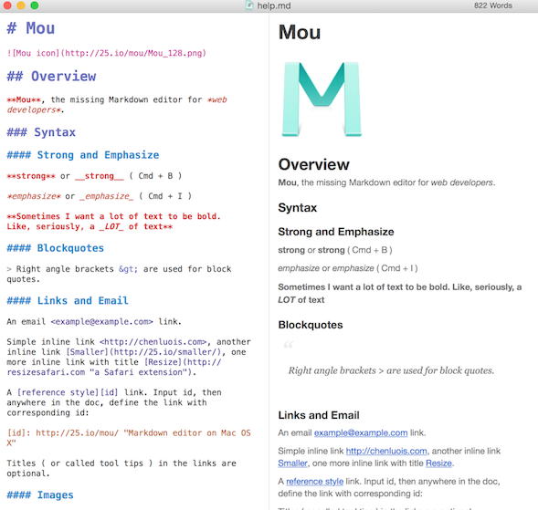

推荐常用的工具
#目录

##[Alfred](http://www.alfredworkflow.com)
Alfred功能强大的工作流软件,可以直接进行对文件进行操作,例如拷贝,粘贴等等。也可以像Spotlight一样索引搜索文件,可以直接输入数字作计算器用,可以查字典,可以当剪贴板用,可以直接当终端用,可以进行网络搜索。
安装完成后使用alt + 空格.
####插几张工作流图片
```
dash快速查询API
```

```
kill进程
```


```
从终端itrem跳转到文件路径
```


```
从文件路径跳转到终端itrem
```


```
各地时间查询
```

##[Beyond compare](http://www.scootersoftware.com)
文件比较工具,除了常规的文本比较外,还提供了三方比较、文件夹比较的功能。


##[brewhome](https://github.com/Homebrew/homebrew/wiki/installation)
包管理工具


##[CheatSheet](http://www.mediaatelier.com/CheatSheet/)
快捷键快速提醒工具,需要按住Command键,会弹出当前应用的所有快捷键列表,


##[Dash](https://kapeli.com/dash)
API文档浏览搜索和代码片段管理功能


##[DropBox](http://www.dropbox.com)
文件同步



##[Iterm2](http://iterm2.com)
终端增强


##[MindNode](https://mindnode.com)
思维导图



##[Moom](http://manytricks.com/moom/)
窗口管理及布局,多屏切换


##[Mou](http://25.io/mou/)
markdown编辑器


##[OmniGraffle](https://www.omnigroup.com/omnigraffle/)
绘图


##[ShadowsocksX](https://github.com/shadowsocks/shadowsocks-iOS/wiki/Shadowsocks-for-OSX-帮助)
翻墙


##[VirtualBox](https://www.virtualbox.org)
虚拟机


##[Wallpapers](https://itunes.apple.com/app/retina-wallpapers-hd-640x960/id384922950?mt=8)
高清桌面壁纸


