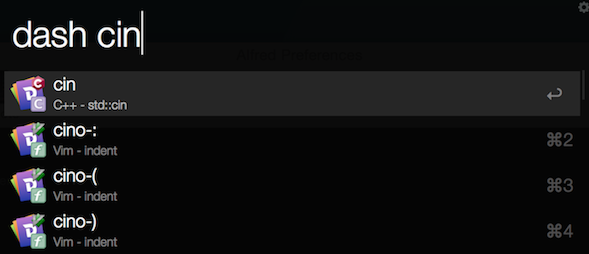
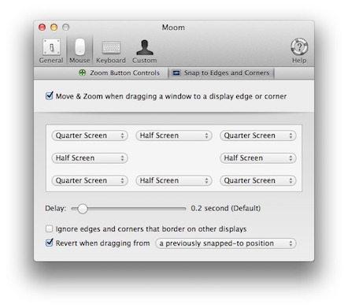
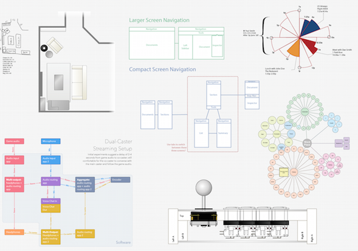
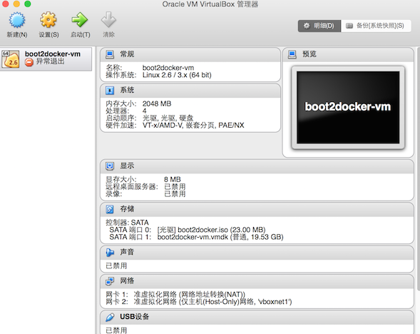
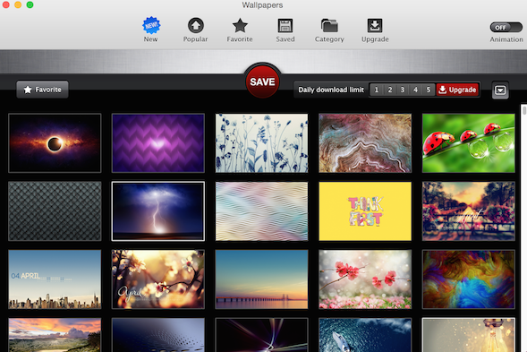

推荐常用的工具
#目录
1. Alfred 
MindNode 
9. Moom 
10. Mou 
11. OmniGraffle
12. ShawodsocksX
13. VirtualBox
13. Wallpapers 

##[Alfred](http://www.alfredworkflow.com)
Alfred高效的工作流软件
####dash快速查询API

####kill进程

####从终端itrem跳转到文件路径

####从文件路径跳转到终端itrem

####各地时间查询

##[Beyond compare](http://www.scootersoftware.com)
文件比较工具,除了常规的文本比较外,还提供了三方比较、文件夹比较的功能。

##[brewhome](https://github.com/Homebrew/homebrew/wiki/installation)
包管理工具

##[CheatSheet](http://www.mediaatelier.com/CheatSheet/)
快捷键快速提醒工具,需要按住Command键,会弹出当前应用的所有快捷键列表,

##[Dash](https://kapeli.com/dash)
API文档浏览搜索和代码片段管理功能

##[DropBox](http://www.dropbox.com)
文件同步

##[Iterm2](http://iterm2.com)
终端增强

##[MindNode](https://mindnode.com)
思维导图

##[Moom](http://manytricks.com/moom/)
窗口管理及布局,多屏切换

##[Mou](http://25.io/mou/)
markdown编辑器

##[OmniGraffle](https://www.omnigroup.com/omnigraffle/)
绘图

##[ShadowsocksX](https://github.com/shadowsocks/shadowsocks-iOS/wiki/Shadowsocks-for-OSX-帮助)
翻墙

##[VirtualBox](https://www.virtualbox.org)
虚拟机

##[Wallpapers](https://itunes.apple.com/app/retina-wallpapers-hd-640x960/id384922950?mt=8)
高清桌面壁纸

